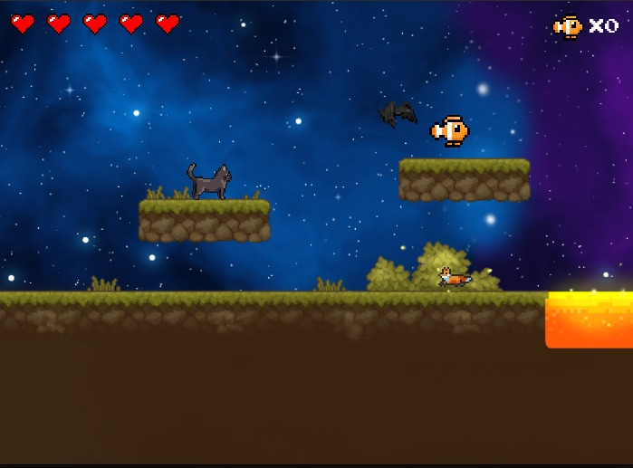

# Trabalho da disciplina prog II: Jogo em Linguagem C 

## Requisitos
É necessário ter a biblioteca Allegro 5 instalada para compilar e executar o jogo:
```bash
sudo apt update
sudo apt install liballegro5-dev
```

## Execução
```bash
make -C code
./code/catland
```

## Controles
WASD : movimento  
SHIFT: correr  
SPACE: pular  
CNTRL: agachar  

## Arquivos:

**main:** executa o loop principal e gerencia a máquina de estados do jogo.

**cat**: funções relacionadas ao jogador.

**land:** funções relacionadas ao mundo do jogo.

**joystick:** controles do jogador.

**states:** estados do jogo (menu, pausa, vitória, game over, etc.).

**save:** sistema de salvamento.

**camera:** câmera que acompanha o jogador.

**physics:** sistema de colisões e gravidade.

**creatures:** funções relacionadas aos inimigos do jogo.

## Sprites 

lava:  
https://www.nicepng.com/ourpic/u2w7r5y3w7q8a9u2_lava-pixel-lava-art-png/  

background:  
https://screamingbrainstudios.itch.io/seamless-space-backgrounds?download  

gato:  
https://last-tick.itch.io/animated-pixel-cats-64x64  

ambiente:  
https://cainos.itch.io/pixel-art-platformer-village-props  

inimigos (raposa e pássaro):  
https://lyaseek.itch.io/miniffanimals  

peixe (coletável):  
https://itch.io/queue/c/5419577/pixel-gnome-packs?game_id=3340156&password=  

## Músicas e Efeitos Sonoros

gato levando dano (minecraft):  
https://www.youtube.com/watch?v=WsTb8HYZd-U  

som do coletável:  
https://www.youtube.com/watch?v=SoZhpnTuQBo  

música principal:  
https://www.youtube.com/watch?v=DzFXGsRvSwA

som da vitória:  
https://www.youtube.com/watch?v=OyTDjr5gpE0  

som do gameover:  
https://www.youtube.com/watch?v=ZS7LAYY2fnE  

